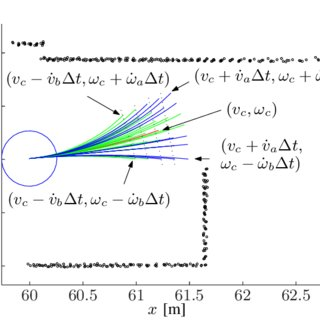

# 机器人规划控制简介

> 推荐书籍： [Planning Algorithm](http://lavalle.pl/planning/book.html), by Steven M. LaValle.

## 1. Overview:

以 [R5](https://core.ac.uk/download/pdf/161917897.pdf) 机器人为例，一个移动机器人常用的软件架构如下图所示。机器人通过传感器获取自身以及外部的信息，从而构建出自己以及周围环境的模型。然后，由规划控制器根据当前的状态信息以及任务目标来制定导航线路以及输出动作来移动机器人，从而改变机器人传感器所感知到的周围环境。

从 90 年代中期开始，机器人的规划控制层便大多采用如下图所示的层级规划结构，从上到下依次是：

- **全局规划器**：根据起点，终点，静态地图信息，以及当前任务需求，以较低的刷新率规划线路。

> 大多数任务都是要求构建出能够避开静态障碍物的，尽可能短的路径。  

- **局部规划器**：根据传感器信息构建小范围的局部地图，以全局规划器的路线为引导，以较高刷新率，实时的进行规划动态路线，以避开动态的障碍物。

- **底层控制器**：根据路径信息生成运动，以驱动机器人按照规划的路径行走。

为了简化机器人规划控制的研究，我们假设机器人具有完美的传感器以及定位建图系统。即机器人可以对自身以及周围世界作出完美的建模。然后我们根据这些信息，以及任务指示，输出一串机器人的未来位姿。

## 2. 全局规划器

不同的任务对应了不同的全局规划器，以扫地机器人为例，常见的任务有**点到点的导航**，以及**区域覆盖规划**。由此对应了不同的规划算法。

### 2.1 点到点路径规划算法

常见的点到点的导航算法又可以分为 Search-based Planning ，以及 Sampling-based Planning：
- Search-based Planning：
  - 广度优先搜索 (BFS)
  - 深度优先搜索 (DFS)
  - Dijkstra
  - A*
  - ...
- Sampling-based Planning：
  - 快速探索随机树 (RRT)
  - 随机路径法 (RPM)
  - ...
- Learning-based
  - 遗传算法 (GA)
  - 强化学习 (Reinforcement Leanrning)
  - ...

> 值得推荐的 Github repo：  [zhm-real/PathPlanning](https://github.com/zhm-real/PathPlanning)

值得注意的是大多数路径规划并不会考虑机器人的运动学约束，因此计算出的路径是如下图所示的，比较僵硬的路线。差分底盘的机器人在跟随这样的路线的时候会在每一个拐点处停顿，然后在转体。而阿克曼底盘的车辆则无法拟合这样的轨迹。因此我们需要根据机器人的运动学约束，对路线进行平滑处理。

### 2.2 路径优化算法

常见的路径优化算法可以分为基于运动学约束的，和插值法

- 基于运动学约束：
  - Improved RRT
  - [AIT](https://arxiv.org/abs/2002.06599)
  - ...

> 基于运动学约束的方法大多都是由原有的路径规划算法改进的。

- 插值法：
  - 多项式插值
  - 贝塞尔曲线
  - 三次样条曲线
  - B样条曲线
  - NURBS 曲线
  - ...

> 推荐阅读：
> - [paper | Path Smoothing Techniques in Robot Navigation: State-of-the-Art, Current and Future Challenges](https://pdfs.semanticscholar.org/f92b/4c8a1db9e94c444a5cadce9e891846215990.pdf)
> - [Zhihu Blog | 路径规划——改进RRT算法](https://zhuanlan.zhihu.com/p/51087819)
> - [Optimization for Smooth Paths](http://www.gameaipro.com/GameAIPro3/GameAIPro3_Chapter20_Optimization_for_Smooth_Paths.pdf)

### 2.3 覆盖规划算法

常用的规划覆盖算法有两种，Boustrophedon Cell Decomposition(BCD) 和 Backtracking Spiral Algorithm (BSA)。

对于复杂而狭小的屋内环境来说，BCD 的用途更加广泛。

> 推荐阅读：
> - [Revisiting Boustrophedon Coverage Path Planning as a Generalized Traveling Salesman Problem](https://arxiv.org/pdf/1907.09224.pdf)

## 3. 局部规划器

之所以使用局部路径规划器是为了能够实时的躲避动态的障碍物，因此选择建立一个以机器人为中心的，小范围的，高刷新率的地图。局部规划器会随着地图的刷新速度，动态的更新所规划的路径。常见的局部规划器有：

- Dynamic Window Approach (DWA)
  - DWA 是根据机器人的运动学约束产生轨迹的，因此轨迹会比较平滑。但避障效果一般，容易被 C 型障碍物卡住。

- Time Elastic Band (TEB)
  - TEB 是让轨迹模拟橡皮筋的拉伸，来避开障碍物。TEB 所预测的轨迹长度大于 WDA，因此从避障效果要好于 DWA，但计算里量也随之增加。

- Artificial Potential Field (APF)
  - APF 的中文是人工势场，即人为的赋予地图一个势力场，让机器人像磁铁一样被目标吸引，同时被障碍物排斥。

